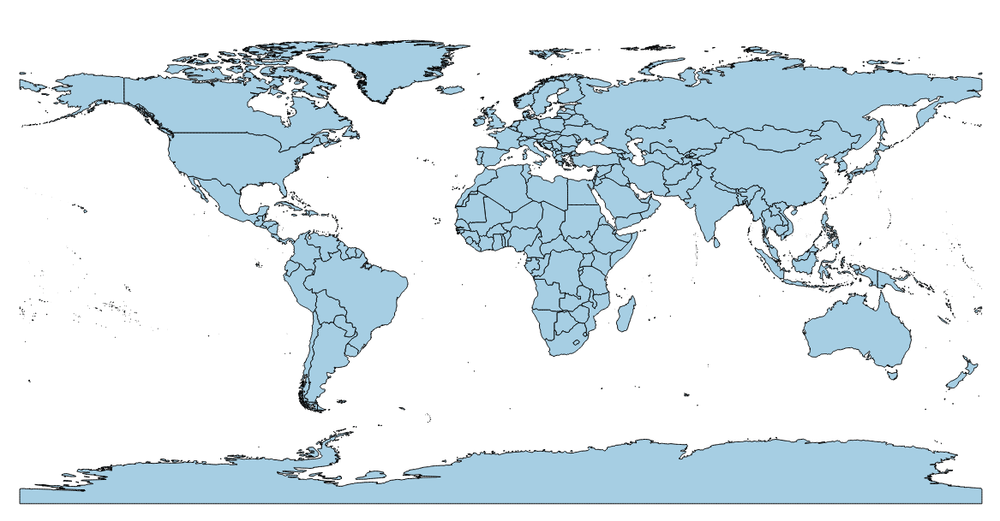

# world_map_with_official_JK_border
Shapefile of countries with India having the official Jammu & Kashmir border. Think I created this by merging some [naturalearthdata] (http://www.naturalearthdata.com/downloads/) shapefiles but I made this so long back I don't remember anymore. In any case, I claim no rights to this shapefile, it's released under an [unlicense](http://unlicense.org/).

